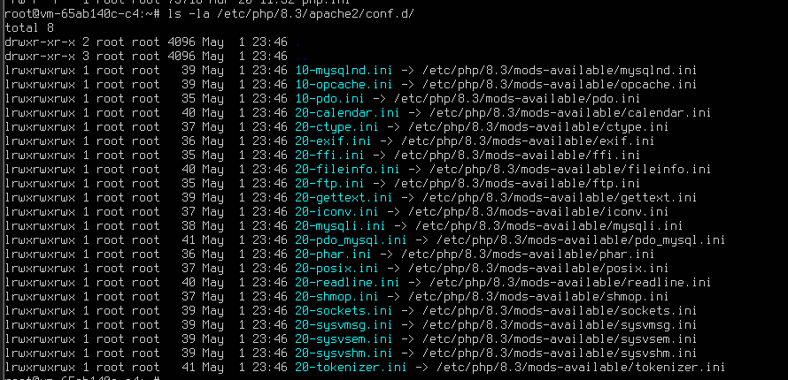

# 前提
- サイトヘルスの内容<br>
    

# 作業前準備
- rootアカウントの作業ディレクトリに移動する
    - 実行コマンド
        ```sh
        cd /root
        ```
    - 確認事項
        - `/root`に移動できたことを確認する。
            - 実行コマンド
                ```sh
                pwd
                ```

- 作業ディレクトリを作成する。
    - 実行コマンド
        ```sh
        mkdir 20260527-01-wordpress-site-health-improvements-php-module
        ```
    - 実行結果
    - 確認事項
        - `/root`配下に`20260527-01-wordpress-site-health-improvements-php-module`が作成されていること
            - 実行コマンド
                ```sh
                ls -la /root/
                ```

- 本件作業ディレクトリに移動する。
    - 実行コマンド
        ```sh
        cd /root/20260527-01-wordpress-site-health-improvements-php-module
        ```
    - 確認事項
        - `/root/20260527-01-wordpress-site-health-improvements-php-module`に移動できていることを確認する。
            - 実行コマンド
                ```sh
                pwd
                ```

- php.iniの配置場所を探す
    - 実行コマンド
        ```sh
        php -i | grep "Loaded Configuration File"
        ```
    - 実行結果<br>
        
    - 所感
        - どうも、php.iniはエクステンションインストール時に自動で更新されることがあるようなので、<br>自分で編集する必要はないみたい。

- PHPのエクステンションのインストールの前に、ubuntuのアップデートを行う。
    - アップデートの取得を行う
        - 実行コマンド
            ```sh
            sudo apt update
            ```
        - 実行結果
    - アップデート対象があるか確認する
        - 実行コマンド
            ```sh
            apt list --upgradable
            ```
        - 実行結果
    - アップデート対象がある場合、アップデートを行う
        - 実行コマンド
            ```sh
            sudo apt upgrade -y
            ```
        - 実行結果
    - OSの再起動が必要なら再起動する。
        - 実行コマンド
            ```sh
            sudo reboot
            ```
        - 実行結果

- PHPのエクステンションが入っているか確認する。
    - 実行コマンド
        ```sh
        php -m | grep -E 'curl|dom|imagick|mbstring|zip|intl|gd'
        ```
    - 実行結果

# バックアップ
- php.iniをバックアップする。
    - 実行コマンド
        ```sh
        sudo cp /etc/php/8.3/apache2/php.ini /etc/php/8.3/apache2/php.ini.bak_$(date +%Y%m%d)
        ```
    - 実行結果
    - 確認事項
        - `php.ini.bak_yyyymmdd`という名前のファイルが作成されていること
            - yyyymmdd部分は、実行日
            - 2026年5月28日に実行した場合は`php.ini.bak_20260528`となる。

- エクステンションインストール前の`/etc/php/8.3/mods-available/`のファイル構成をバックアップする
    - 実行コマンド
        ```sh
        ls -la /etc/php/8.3/mods-available/ > before_mods_available.txt
        ```
    - 確認事項
        - `root/20260527-01-wordpress-site-health-improvements-php-module`配下に、`before_mods_available.txt`が作成されていることを確認する。
            - 実行コマンド
                ```sh
                ls -la root/20260527-01-wordpress-site-health-improvements-php-module
                ```
        - `before_mods_available.txt`に中身があることを確認する。
            - 実行コマンド
                ```sh
                less root/20260527-01-wordpress-site-health-improvements-php-module/before_mods_available.txt
                ```

- エクステンションインストール前の`/etc/php/8.3/apache2/conf.d/`のファイル構成をバックアップする
    - 実行コマンド
        ```sh
        ls -la /etc/php/8.3/apache2/conf.d/ > before_apache2_conf.d.txt
        ```
    - 確認事項
        - `root/20260527-01-wordpress-site-health-improvements-php-module`配下に、`before_apache2_conf.d.txt`が作成されていることを確認する。
            - 実行コマンド
                ```sh
                ls -la root/20260527-01-wordpress-site-health-improvements-php-module
                ```
        - `before_apache2_conf.d.txt`に中身があることを確認する。
            - 実行コマンド
                ```sh
                less root/20260527-01-wordpress-site-health-improvements-php-module/before_apache2_conf.d.txt
                ```

# PHPのエクステンションのインストール
- PHPのエクステンションをインストールする
    - 実行コマンド
        ```sh
        sudo apt install php-curl php-xml php-mbstring php-zip php-intl php-imagick php-gd -y
        ```

- Apache2を再起動する。
    - 実行コマンド
        ```sh
        sudo systemctl restart apache2
        ```

# インストール後チェック
- PHPのエクステンションがインストールされていることを確認する
    - 実行コマンド
        ```sh
        php -m | grep -E 'curl|dom|imagick|mbstring|zip|intl|gd'
        ```
    - 実行結果
    - 確認事項
        - 下記のエクステンションがインストールされていること
            - curl
            - dom
            - imagick
            - mbstring
            - zip
            - intl
            - gd

- php.iniに更新内容があるか確認する
    - 実行コマンド
        ```sh
        sudo diff -u /etc/php/8.3/apache2/php.ini.bak_20260527 /etc/php/8.3/apache2/php.ini
        ```
    - 実行結果
    - 確認事項
        - 下記のエクステンションが有効化されていること
            - curl
            - dom
            - imagick
            - mbstring
            - zip
            - intl
            - gd
        - もし、差異が出ない場合は、php.iniを編集する形ではなく下記の内容が更新されている可能性がある
            - `/etc/php/8.3/mods-available/`<br>
                
            - `/etc/php/8.3/apache2/conf.d/`<br>
                

- エクステンションインストール後の`/etc/php/8.3/mods-available/`のファイル構成をバックアップする
    - 実行コマンド
        ```sh
        ls -la /etc/php/8.3/mods-available/ > after_mods_available.txt
        ```
    - 確認事項
        - `root/20260527-01-wordpress-site-health-improvements-php-module`配下に、`after_mods_available.txt`が作成されていることを確認する。
            - 実行コマンド
                ```sh
                ls -la root/20260527-01-wordpress-site-health-improvements-php-module
                ```
        - `after_mods_available.txt`に中身があることを確認する。
            - 実行コマンド
                ```sh
                less root/20260527-01-wordpress-site-health-improvements-php-module/after_mods_available.txt
                ```

- インストール前後の`/etc/php/8.3/mods-available/`のファイル構成を比較する。
    - 実行コマンド
        ```sh
        sudo diff -u root/20260527-01-wordpress-site-health-improvements-php-module/before_mods_available.txt root/20260527-01-wordpress-site-health-improvements-php-module/after_mods_available.txt
        ```
    - 実行結果
    - 確認事項
        - 下記のエクステンションに関するiniファイルが増えていること。
            - curl
            - dom
            - imagick
            - mbstring
            - zip
            - intl
            - gd

- エクステンションインストール後の`/etc/php/8.3/apache2/conf.d/`のファイル構成をバックアップする
    - 実行コマンド
        ```sh
        ls -la /etc/php/8.3/apache2/conf.d/ > after_apache2_conf.d.txt
        ```
    - 確認事項
        - `root/20260527-01-wordpress-site-health-improvements-php-module`配下に、`after_apache2_conf.d.txt`が作成されていることを確認する。
            - 実行コマンド
                ```sh
                ls -la root/20260527-01-wordpress-site-health-improvements-php-module
                ```
        - `after_apache2_conf.d.txt`に中身があることを確認する。
            - 実行コマンド
                ```sh
                less root/20260527-01-wordpress-site-health-improvements-php-module/after_apache2_conf.d.txt
                ```

- インストール前後の`/etc/php/8.3/apache2/conf.d/`のファイル構成を比較する。
    - 実行コマンド
        ```sh
        sudo diff -u root/20260527-01-wordpress-site-health-improvements-php-module/before_apache2_conf.txt root/20260527-01-wordpress-site-health-improvements-php-module/after_apache2_conf.txt
        ```
    - 実行結果
    - 確認事項
        - 下記のエクステンションに関するiniファイルへのリンクが増えていること。
            - curl
            - dom
            - imagick
            - mbstring
            - zip
            - intl
            - gd

# WordPress管理画面の確認
- WordPressのダッシュボードにアクセスする。
- サイトヘルスを開き、モジュールに関する`1件の致命的な問題`が改善されていることを確認する。