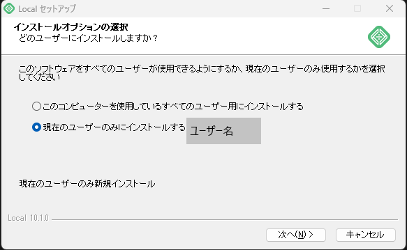
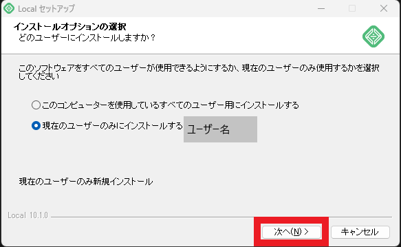
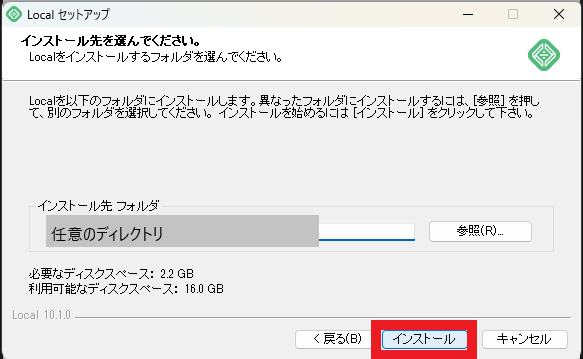
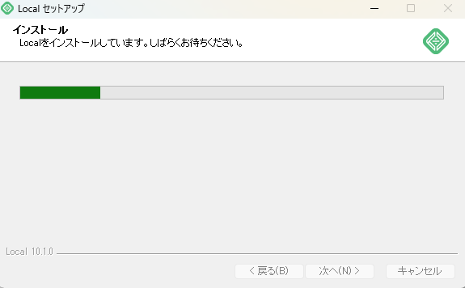
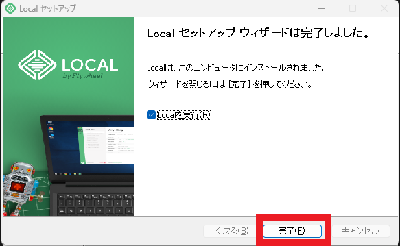

# localWPのインストール

## インストール
- `local-10.1.0-windows.exe`を起動する。
- `Local セットアップ`ウィンドウが展開されるのを確認します。
    
- `インストールオプションの選択`画面で下記の内容を選択し`次へ(N)>`を押下する。
     
- `インストール先を選んでください。`画面で任意のインストール先フォルダを指定し、`インストール`ボタンを押下します。
    
- `インストール`画面に遷移することを確認します。
    
- `Localセットアップ ウィザードは完了しました。`画面が出たら`完了(F)`ボタンを押下します。
    
- LocalWPが起動することを確認します。
    