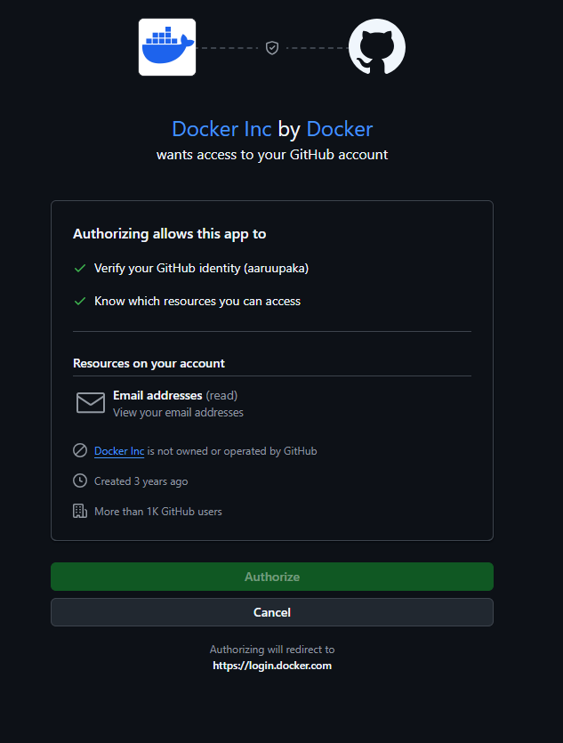
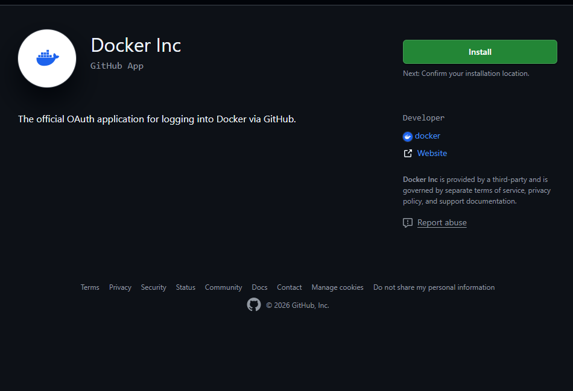
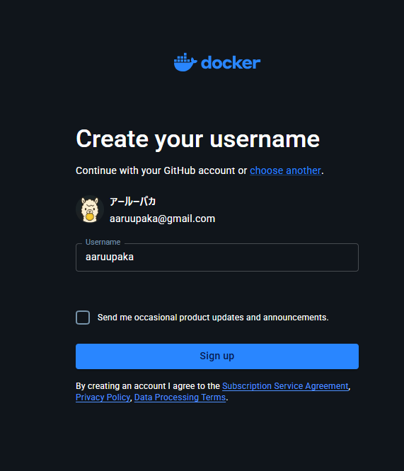
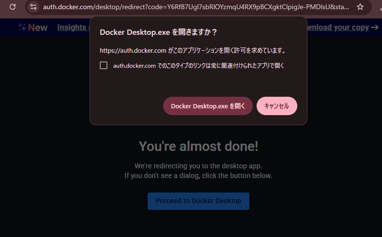
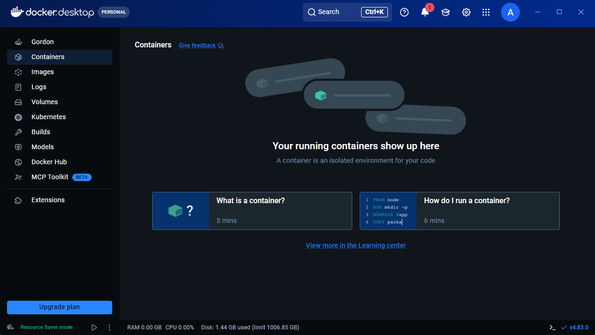

# Docker Desktop　アカウント作成
- Docker DesktopへのログインはGitHub連携で行った。
    

- DockerへのログインをGitHub連携にした際にでたgithub app?のダウンロードリンク
    (docker-inc)[https://github.com/apps/docker-inc]
    - GitHubとDockerを意図的に連携する際にインストールする予定
    - 現在は未インストール
        

- GitHub連携画面で`Authorize`押下後、username設定を行う画面が出た
    

- `Username`を指定後、`Sign up`を押下。

- 2段階認証後、何らかの処理が行われた

- `Docker　Desktop.exeを開く`か確認されたので、開くことに

- Docker Desktopでログインされたっぽい
