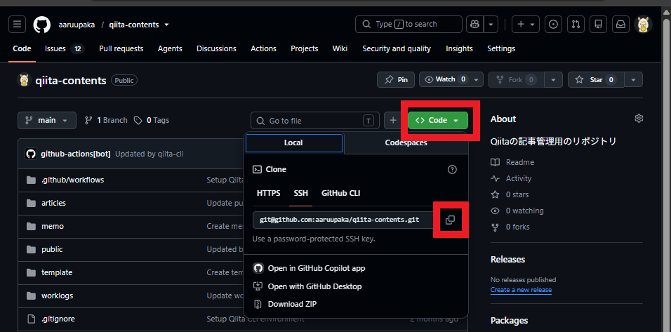

# はじめに
今回は、QiitaとGitHubの連携を行います。

記事数が増えてきたため、GitHub上で管理できる環境を構築することにしました。

今回、私が使用しているPCにすでに入っているNodistを利用したNode.js環境を使用しています。
参考にならない可能性が高いですが、Node.jsの入れ直しよりも、QiitaとGitHubの連携を最優先で進めたいと考えています。

# 作業環境
- OS:Windows 11 Home
- バージョン:22h2
- Node.js管理ツール:Nodist
- Nodeバージョン:v22.4.0
- npmバージョン:10.2.3
- npxバージョン:10.2.3
- CLIツール:terminal

# Node.js環境の動作確認

Node.jsおよび、npm、npxがインストールされているか、また、問題なく動作しているかを確認します。

- Node.jsのインストール状況確認および動作確認をする。
  - 実行コマンド
    ```bash
    node -v
    ```
  - 実行結果
    ```bash
    v22.4.0
    ```
  - 確認事項
    - バージョン情報が出力されること
    - エラーが出ないこと

- npmのインストール状況確認および動作確認をする。
  - 実行コマンド
    ```bash
    npm -v
    ```
  - 実行結果
    ```bash
    10.2.3
    ```
  - 確認事項
    - バージョン情報が出力されること
    - エラーが出ないこと

- npxのインストール状況確認および動作確認をする。
  - 実行コマンド
    ```bash
    npx -v
    ```
  - 実行結果
    ```bash
    10.2.3
    ```
  - 確認事項
    - バージョン情報が出力されること
    - エラーが出ないこと

# GitHubでQiita記事管理用のリポジトリを作成する。
Qiita記事管理用のリポジトリを作成します。
私は下記のような内容で作成しました。


# 作成したリポジトリをローカルPCにCloneする。
- terminal(PowerShell)を起動します。

- リポジトリを管理するフォルダに移動します。
  - 実行コマンド
    ```bash
    cd リポジトリ管理フォルダパス
    ```
  - 実行コマンド例
    ```
    cd c:\git
    ```

- GitHubのCodeボタンからURLを取得します。
  <br>

- cloneを実行します。
  - 実行コマンド
    ```
    git clone <URL>
    ```
  - 実行コマンド例
    ```
    git clone git@github.com:test/qiita-contents.git
    ```
  - 実行結果
    ```
    Cloning into 'qiita-contents'...
    Enter passphrase for key '/c/Users/test/.ssh/test-ssh-key':
    remote: Enumerating objects: 3, done.
    remote: Counting objects: 100% (3/3), done.
    remote: Compressing objects: 100% (2/2), done.
    remote: Total 3 (delta 0), reused 0 (delta 0), pack-reused 0 (from 0)
    Receiving objects: 100% (3/3), done.
    ```

- cloneしたディレクトリに移動します。
  - 実行コマンド
    ```
    cd .\リポジトリ名\
    ```
  - 実行コマンド例
    ```
    cd .\qiita-contents\
    ```

# Qiita CLIを導入する
- Qiitaコンテンツを管理したいフォルダにいることを確認します。
  - 実行コマンド
    ```
    pwd
    ```

- Qiita CLIのインストールコマンドを実行します。
  - 実行コマンド
    ```bash
    npm install @qiita/qiita-cli --save-dev
    ```
  - 実行結果
    ```bash
    added 111 packages in 24s
    
    49 packages are looking for funding
      run `npm fund` for details
    npm notice
    npm notice New major version of npm available! 10.2.3 -> 11.14.1
    npm notice Changelog: https://github.com/npm/cli/releases/tag/v11.14.1
    npm notice Run npm install -g npm@11.14.1 to update!
    npm notice
    ```

- `ls`コマンドを実行し下記のディレクトリおよび、フォルダが作成されていることを確認します。
  - 確認フォルダおよびファイル
    - フォルダ
      - node_modules
    - ファイル
      - package-lock.json
      - package.json
  - 実行コマンド
    ```
    ls
    ```

- Qiita CLIのバージョンチェックコマンドを実行します。
  - 実行コマンド
    ```
    npx qiita version
    ```
  -　実行結果
    ```
    ◇ injected env (0) from .env // tip: ⌘ enable debugging { debug: true }
    1.8.0
    ```

- Qiita CLI をアップデートコマンドを実行します。

最新版のQiita CLIを利用できるようため、念のためアップデートを実施します。

  - 実行コマンド
    ```
    npm install @qiita/qiita-cli@latest
    ```
  - 実行結果
    ```
    up to date, audited 112 packages in 2s

    49 packages are looking for funding
      run `npm fund` for details
    
    found 0 vulnerabilities
    ```
# Qiitaのトークンを作成する。

- Qiitaの設定画面内の`アプリケーション`タブの`新しくトークンを発行する`リンクを押下します。
  

- `アクセストークンの説明`で任意の値を入力後、`スコープ`で下記の内容のチェックボックスを有効化し、`発行する`ボタンを押下します。
  - read_qiita
  - write_qiita
  

- 生成されたトークンをコピーします。
  

# GitHub ActionsのSecretsを設定します。
Qiita CLIでは、GitHubへpushした際にGitHub Actionsを利用してQiitaへ記事を同期する機能があります。

この機能を有効化するためには、事前にアクセストークンをGitHub Secretsへ登録する必要があります。

- Qiita記事管理用のリポジトリにアクセスします。

- リポジトリの設定画面の`security and quality`>`Secrets and variables`>`Actions`内、Repository secretsの`New repository secret`ボタンを押下します。
  

- 下記の項目を記入し、`Add secret`ボタンを押下します。
  - Name
    - QIITA_TOKEN
  - Secret
    - 生成されたトークン
 

- `Repository secrets`に`QIITA_TOKEN`が追加されたことを確認します。
 

# Qiita CLIのセットアップ
- initコマンドを実行します。
  - 実行コマンド
    ```
    npx qiita init
    ```
  - 実行結果
    ```
    ◇ injected env (0) from .env // tip: ◈ encrypted .env [www.dotenvx.com]
    設定ファイルを生成します。
    
      Creating D:\a_pjs\2026051401_aaruupaka_qiita-contents\qiita-contents\.github\workflows\publish.yml
         Created!
    
      Creating D:\a_pjs\2026051401_aaruupaka_qiita-contents\qiita-contents\.gitignore
         Created!
    
      Creating D:\a_pjs\2026051401_aaruupaka_qiita-contents\qiita-contents\qiita.config.json
         Created!
    
    Success! ✨
    
    次のステップ:
    
      1. トークンを作成してログインをしてください。
        npx qiita login
    
      2. 記事のプレビューができるようになります。
        npx qiita preview
    ```

- terminal上でQiita CLIのログインコマンドを実行し、生成したトークンを入力後、`Enter`を入力します。
  - 実行コマンド
    ```
    npx qiita login
    ```
  - 実行結果
    ```
    ログインが完了しました 🎉
    以下のコマンドを使って執筆を始めましょう！
    
    🚀 コンテンツをブラウザでプレビューする
      npx qiita preview
    
    🚀 新しい記事を追加する
      npx qiita new (記事のファイルのベース名)
    
    🚀 記事を投稿、更新する
      npx qiita publish (記事のファイルのベース名)
    
    💁 コマンドのヘルプを確認する
      npx qiita help
    ```

# GitHubリポジトリに今回作業で生成されたファイルおよびディレクトリを反映する。
- Gitのステータスを確認します。
  - 実行コマンド
    ```bash
    git status
    ```
  - 実行結果
    ```
    On branch main
    Your branch is up to date with 'origin/main'.
    
    Untracked files:
      (use "git add <file>..." to include in what will be committed)
            .github/
            .gitignore
            package-lock.json
            package.json
            qiita.config.json
    
    nothing added to commit but untracked files present (use "git add" to track)
    ```

- 変更をstageへ追加します。
  - 実行コマンド
    ```bash
    git add .
    ```

- 再度ステータスを確認します。
  - 実行コマンド
    ```bash
    git status
    ```
  - 実行結果
    ```
    On branch main
    Your branch is up to date with 'origin/main'.
    
    Changes to be committed:
      (use "git restore --staged <file>..." to unstage)
            new file:   .github/workflows/publish.yml
            new file:   .gitignore
            new file:   package-lock.json
            new file:   package.json
            new file:   qiita.config.json
    
    ```

- コミットします。（コメントは任意の内容で大丈夫です。）
  - 実行コマンド
    ```bash
    git commit -m "Setup Qiita CLI environment"
    ```
  - 実行結果
    ```
    [main 73c4640] Setup Qiita CLI environment
     5 files changed, 1463 insertions(+)
     create mode 100644 .github/workflows/publish.yml
     create mode 100644 .gitignore
     create mode 100644 package-lock.json
     create mode 100644 package.json
     create mode 100644 qiita.config.json
    ```

- プッシュします。
  - 実行コマンド
    ```bash
    git push origin main
    ```
  - 実行結果
    ```
    Enumerating objects: 10, done.
    Counting objects: 100% (10/10), done.
    Delta compression using up to 8 threads
    Compressing objects: 100% (6/6), done.
    Writing objects: 100% (9/9), 13.13 KiB | 1.64 MiB/s, done.
    Total 9 (delta 0), reused 0 (delta 0), pack-reused 0 (from 0)
    To github.com:aaruupaka/qiita-contents.git
       c92095d..73c4640  main -> main
    ```

# おわりに
今回は、Qiita CLIを導入し、GitHubと連携してQiitaの記事をGitHubリポジトリで管理する環境を構築しました。

一度環境を整えてしまえば、ローカル環境で記事を管理しながらGitで変更履歴を残せるようになり、複数端末での作業やバックアップも行いやすくなります。

本記事が、Qiita CLIを使った記事管理環境の構築を進める際の参考になれば幸いです。

# 参考資料
- Qiita(@Qiita)「Qiitaの記事をGitHubリポジトリで管理する方法」

https://qiita.com/Qiita/items/32c79014509987541130

- GitHub qiita-cli/READE.me 「Qiita CLI、Qiita Preview へようこそ！」

https://github.com/increments/qiita-cli/blob/main/README.md
