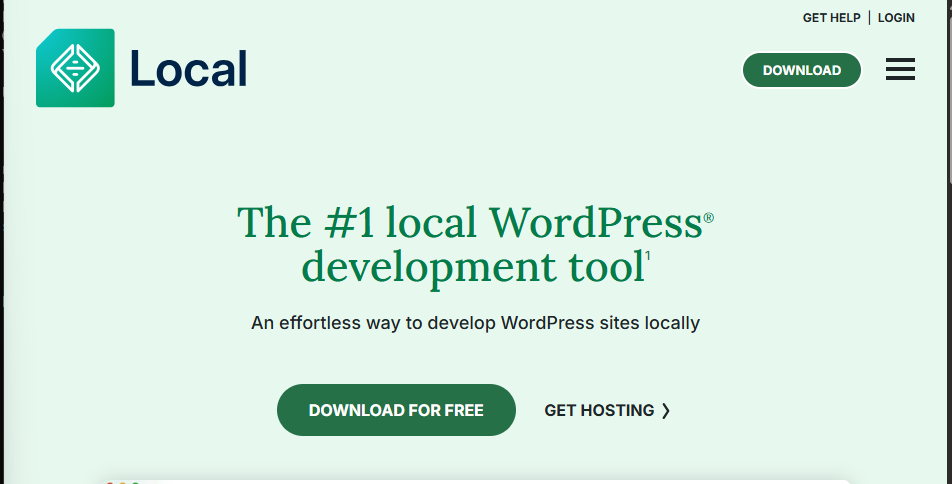
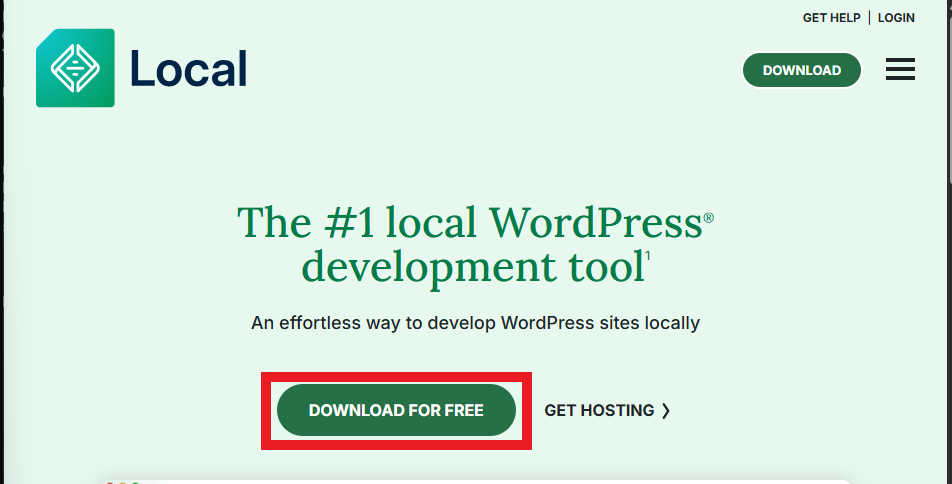
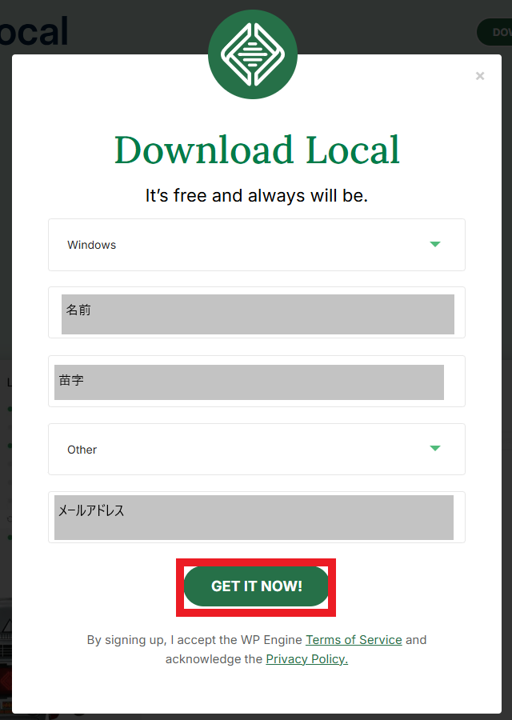
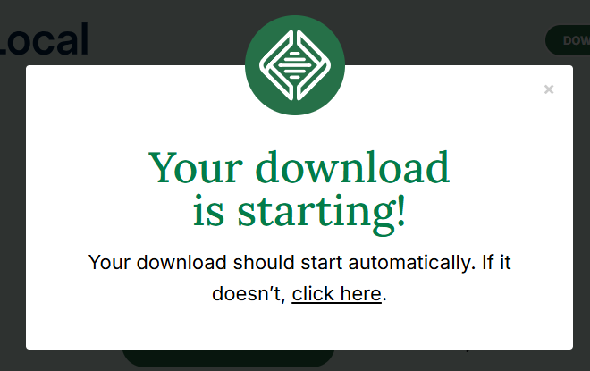

# localWPのダウンロード

## 公式サイトにアクセス
- 下記URLにアクセスします。
    - URL : `https://localwp.com/`
         

## localWPダウンロード
- `DOWNLOAD FOR FREE`ボタンを押下します。
     

- 各項目を入力し、`GET IT NOW!`ボタンを押下します。
     

- ダウンロードが完了するのを待機します。
     

- `local-10.1.0-windows.exe`がダウンロードされたことを確認します。

# localWPのインストール

## インストール
- `local-10.1.0-windows.exe`を起動します。

- `Local セットアップ`ウィンドウが展開されるのを確認します。
     

- `インストールオプションの選択`画面で下記の内容を選択し`次へ(N)>`を押下する。
      

- `インストール先を選んでください。`画面で任意のインストール先フォルダを指定し、`インストール`ボタンを押下します。
     

- `インストール`画面に遷移することを確認します。
     

- `Localセットアップ ウィザードは完了しました。`画面が出たら`完了(F)`ボタンを押下します。
     

- LocalWPが起動することを確認します。
     