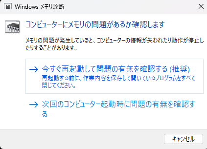
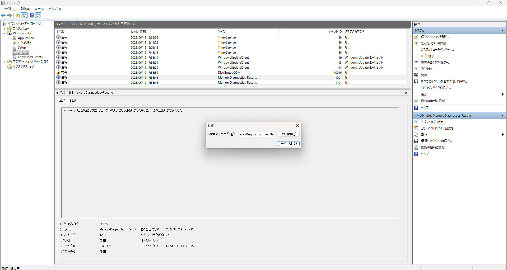
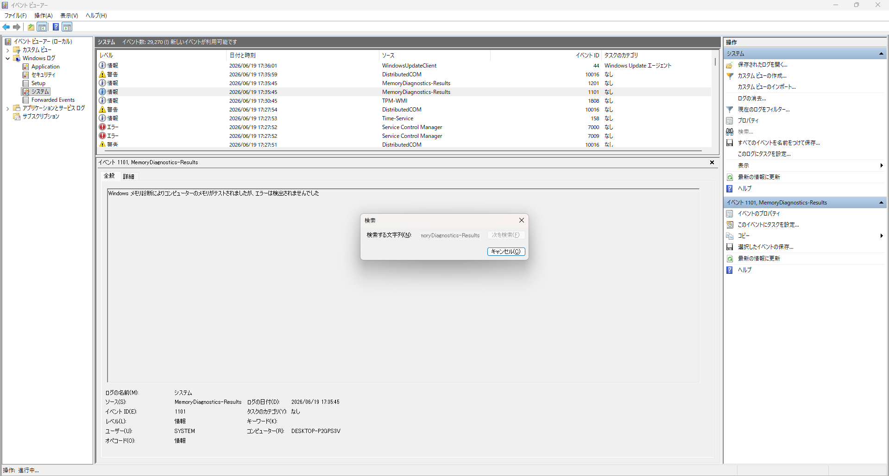

# はじめに
作業中、突如「デバイスに問題が発生したため再起動します。」と黒背景、白文字で表示され、PCが再起動しました。
現在メインで作業しているPCで発生したのと、
初めての挙動なので大変驚きました。

今回、情報がなさすぎるのと、初めての経験でそもそも何をすればいいのかわからなかったので、ChatGPTの助けを借りて対応しました。

今回は、この原因の調査を行った際の記録を公開します。

# ChatGPTに相談だ！
まず手始めにChatGPTに下記の内容を相談しました。
- 「windowsに関して、デバイスに問題が発生したため再起動します。」と黒背景白文字で出て再起動したこと。
- 今まで起きたことがないこと。
- そもそも何が起きたかわからず、原因の調べ方が思いつかないこと。

その結果下記の返答がありました。
- 俗にいう ブルースクリーン（BSOD） の一種であること。
- 原因の調査方法としては下記があること。
  - イベントビューアーを確認する
  - 信頼性モニターを確認する
  - ダンプファイルを確認する


# 信頼性モニターを見る
ChatGPTに提示された選択肢の中から
今回は、「信頼性モニターを確認すること」を行うことにします。

- 下記の手順で「信頼性の履歴の表示」を開きます。
    1. Windowsキー
    2. 「信頼性」と入力
    3. 「信頼性履歴の表示」

- 下記のように表示されました。
    
    - 今回、重要なエラーは5件起きていたようです。
        - しかし、そのうち`SYNCROOM`はPC再起動後に間違えて起動した上、エラーが起きたものなので、今回は関係ないと判断します。
    - また、余談ですが、今日だけでなく思いのほかエラーが起きているなという印象を抱きました。

- `Windowsの動作が停止しました`の詳細を開きます。
    
    ```
    このコンピューターはバグチェック後、再起動されました。バグチェック: 0x0000001a (0x0000000000006000, 0xffffca85ab9a7870, 0xffffffffc0000225, 0x0000000000001000)。ダンプの保存先: C:\WINDOWS\Minidump\061926-16171-01.dmp。レポート ID: fef2a33f-9dfa-41e8-8f62-85dd13d3a6dc。
    ```
- 上記の出力内容をChatGPTに共有し次の指示を仰ぎます。

# `sfc`コマンドおよび`DISM`コマンドを実行する。
ChatGPTに停止コードを共有したところ、`Windowsがメモリ管理の異常を検出したため強制停止した`ことを意味することを教えてもらいました。

この停止コードは、メモリそのものだけでなく、ドライバーやシステムファイルなどが原因で発生することもあるとのことです。


また、下記の二つのコマンドを実行することを勧められました。
```cmd
sfc /scannow
DISM /Online /Cleanup-Image /RestoreHealth
```

- 管理者権限を持ったコマンドプロンプトを起動します。

- 下記の`sfc`コマンドを実行します。
    - 実行コマンド
        ```cmd
        sfc /scannow
        ```
    - 実行結果
        ```
        システム スキャンを開始しています。これにはしばらく時間がかかります。

        システム スキャンの検証フェーズを開始しています。
        検証 100% が完了しました。

        Windows リソース保護により、破損したファイルが見つかりましたが、それらは正常に修復されました。
        オンライン修復の場合、詳細は次の場所にある CBS ログ ファイルに含まれています
        windir\ Logs\CBS\CBS.log (たとえば C:\Windows\Logs\CBS\CBS.log)。オフライン修復の場合、
        詳細は /OFFLOGFILE フラグによって指定したログ ファイルに含まれています。
        ```
    - 実行結果から読み取れたこと
        - 実際にWindowsシステムファイルが破損していたようです。
        - 破損したこと自体、驚きではありますが、修復されたようなのでひとまず安心しました。

- 次は下記の`DISM`コマンドを実行します。
    - 実行コマンド
        ```cmd
        DISM /Online /Cleanup-Image /RestoreHealth
        ```
    - 実行結果
        ```
        展開イメージのサービスと管理ツール
        バージョン: 10.0.26100.8521

        イメージのバージョン: 10.0.26200.8655

        [==========================100.0%==========================] 復元操作は正常に完了しました。
        操作は正常に完了しました。
        ```
    - 実行結果から読み取れたこと
        - 復元操作が正常に完了したことを確認しました。

- 再度、下記のコマンドを実行します。
    - 実行コマンド
        ```cmd
        sfc /scannow
        ```
    - 実行結果
        ```
        システム スキャンを開始しています。これにはしばらく時間がかかります。

        システム スキャンの検証フェーズを開始しています。
        検証 100% が完了しました。

        Windows リソース保護は、整合性違反を検出しませんでした。
        ```
    - 実行結果から読み取れたこと
        - 現時点ではWindowsのファイルに問題が発生していないということ

- 再度、下記のコマンドを実行します。
    - 実行コマンド
        ```cmd
        DISM /Online /Cleanup-Image /RestoreHealth
        ```
    - 実行結果
        ``` 
        展開イメージのサービスと管理ツール
        バージョン: 10.0.26100.8521

        イメージのバージョン: 10.0.26200.8655

        [==========================100.0%==========================] 復元操作は正常に完了しました。
        操作は正常に完了しました。
        ```
    - 実行結果から読み取れたこと
        - 前回実施時と内容が変わっていないことを確認しました。

- 念のため、再起動を行います。
- 実行結果をChatGPTに共有し、次の推奨手順を確認します。

# メモリ診断を行う
実行結果を共有したところ、次はメモリ診断の実施を進められました。

- Windows メモリ診断を起動します。
    - 下記手順で起動できます。
        1. Windowsキーを押す
        2. 「メモリ診断」と入力する
        3. 「Windows メモリ診断」を起動する

- 下記を選択し、診断を開始します。
    
    - 今すぐ再起動して問題の有無を確認する（推奨）

- 診断が完了するまで待機します。

- イベントビューアーで診断結果を確認します。
    1. Windowsキーを押す
    2. 「イベントビューアー」を起動する
    3. 以下を開く
        ```text
        Windowsログ
        └ システム
        ```
    4. 「検索...」をクリックする
    5. 検索ポップアップに以下を入力し、`Enter`を押下します
        ```text
        MemoryDiagnostics-Results
        ```
    6. 結果を確認します。
        
        
        - メモリに関しては問題なさそうだとわかりました。

# 結論
今回はBSOD発生後にシステムファイルの破損が検出されました。

sfcおよびDISMを実施した結果、現在は整合性違反が検出されない状態になりました。

ただし、BSODの原因そのものがシステムファイルだったかどうかは断定できないため、今後も再発しないか様子を見る予定です。

# 終わりに
今回は、「デバイスに問題が発生したため再起動します。」と出てしまった原因を調査しました。

今回の事象は初めての経験で、困惑しましたが、
ChatGPTに質問しつつ作業を進めることができたので、
比較的容易に原因の特定及び復元をすることができました。

もし一から調べていたら解決できなかった可能性もあるので、
AI様様ですね...!


    