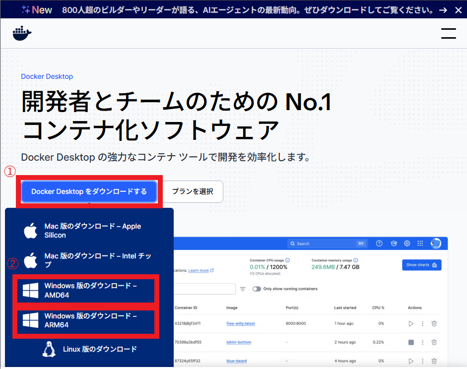
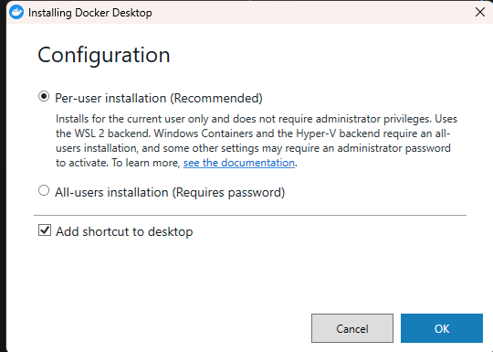
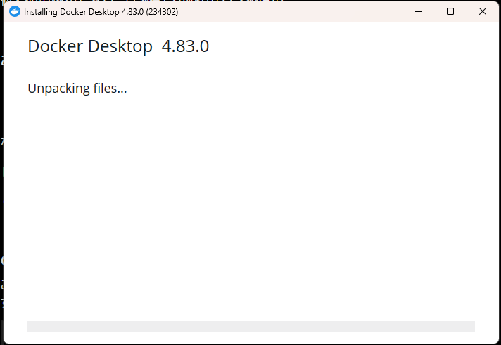
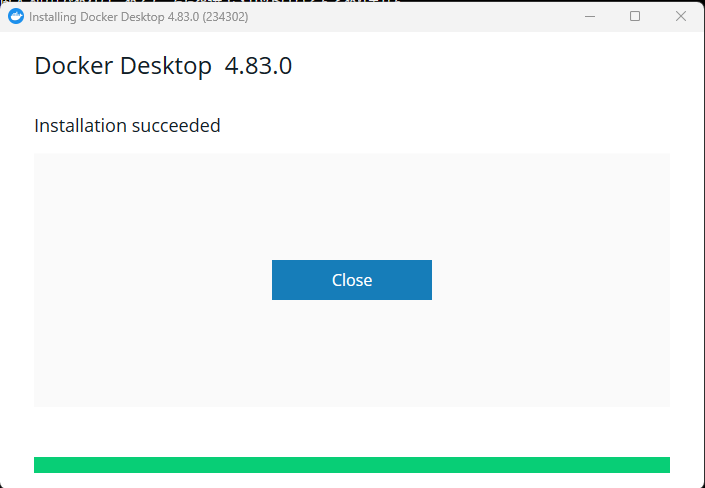
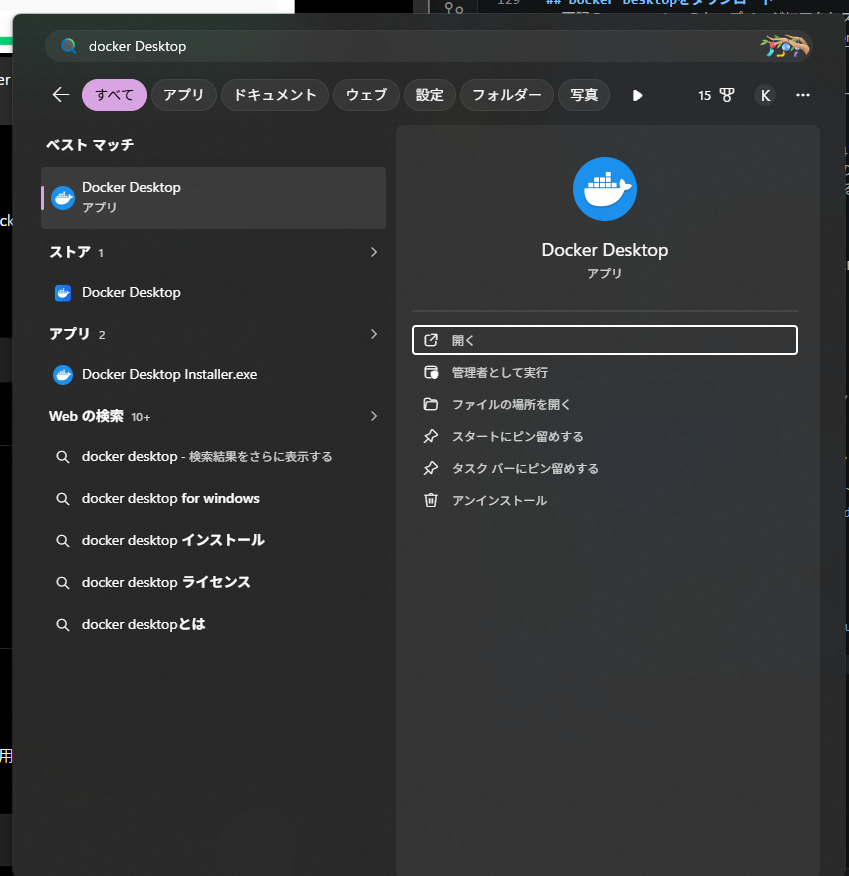
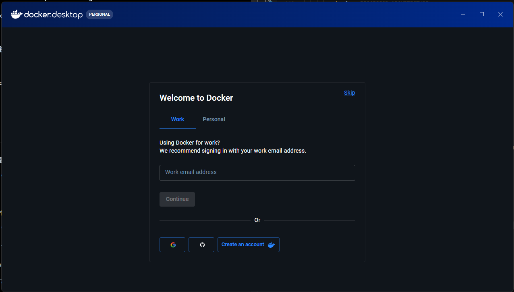

# 環境情報
- OS: `Windows 11`
- WSL: WSL2
- WSL2 Linuxディストリビューション: Ubuntu

# 前提条件
- WSL2がインストールされていること
- WSL2でubuntuがインストールされていること

::: note info
WSL2で利用するディストリビューションはUbuntuである必要はないと思いますが、私の環境はUbuntuであるため、指定しています。
任意のディストリビューションで問題ありません。
:::

# WSLの状態確認
- Windows Terminal（PowerShell）を起動します。

- WSLのステータスを確認します。
  - 実行コマンド
    ```bash
    wsl --status
    ```
  - 実行結果例
    ```bash
    既定のディストリビューション: Ubuntu
    既定のバージョン: 2
    WSL1 は、現在のマシン構成ではサポートされていません。
    WSL1 を使用するには、"Linux 用 Windows サブシステム" オプション コンポーネントを有効にしてください。
    ```
  - 確認事項
    - WSL2が使用可能な状態であること。

- インストール済みのLinuxの状態を確認します。
  - 実行コマンド
    ```bash
    wsl -l -v
    ```
  - 実行結果例
    ```bash
      NAME      STATE           VERSION
    * Ubuntu    Stopped         2
    ```
  - 確認事項
    - `Ubuntu`がインストールされていること

## WSLの更新
- WSLの更新をします。
  - 実行コマンド
    ```bash
    wsl --update
    ```
  - 実行結果例
    ```bash
    更新プログラムを確認しています。
    Linux 用 Windows サブシステムの最新バージョンは既にインストールされています。
    ```
- WSLのバージョンを確認します。
  - 実行コマンド
    ```bash
    WSL バージョン: 2.7.10.0
    カーネル バージョン: 6.18.33.2-2
    WSLg バージョン: 1.0.73.2
    MSRDC バージョン: 1.2.6676
    Direct3D バージョン: 1.611.1-81528511
    DXCore バージョン: 10.0.26100.1-240331-1435.ge-release
    Windows バージョン: 10.0.26200.8894
    ```

## Ubuntuの更新
- Ubuntuを起動します。
  - 実行コマンド
    ```bash
    wsl
    ```
  - 実行結果例
    ```bash
    To run a command as administrator (user "root"), use "sudo <command>".
    See "man sudo_root" for details.

    test@testpc:/mnt/c/Users/test$
    ```

- Ubuntuの更新内容を取得します。
  - 実行コマンド
    ```bash
    sudo apt update
    ```
  - 実行結果例
    ```bash
    ...(一部省略)
    Fetched 35.8 MB in 8s (4516 kB/s)
    Reading package lists... Done
    Building dependency tree... Done
    Reading state information... Done
    238 packages can be upgraded. Run 'apt list --upgradable' to see them.
    ```

- Ubuntuの更新を行います。
  - 実行コマンド
    ```bash
    sudo apt upgrade -y
    ```
  - 実行結果例
    ```
    ...(一部省略)
    Setting up ubuntu-wsl (1.539.2) ...
    Processing triggers for ca-certificates (20260601~24.04.1) ...
    Updating certificates in /etc/ssl/certs...
    0 added, 0 removed; done.
    Running hooks in /etc/ca-certificates/update.d...
    done.
    ```

# Docker Desktopの導入手順

## Docker Desktopをダウンロード
- 下記のURL、Dockerのトップページにアクセスします。
  [Doker Desktop](https://www.docker.com/ja-jp/products/docker-desktop/)

- `Docker Desktopをダウンロードする`にカーソルを合わせたのち、自身の環境にあった選択肢を選択します。
  
  - 私は`Windows 版のダウンロード – AMD64`を選択しました。
  - OSおよびCPUにより、ダウンロードするものが異なります。
    - Windowsの場合、下記コマンドを実行することで、どちらをダウンロードすべきか確認できます。
      - 実行コマンド
        ```bash
        echo $env:PROCESSOR_ARCHITECTURE
        ```
      - 実行結果例
        ```bash
        AMD64
        ```

- `Docker Desktop Installer.exe`がダウンロードされたことを確認します。

## Docker Desktopのインストール
- `Docker Desktop Installer.exe`を起動します。

- `Configuration`画面で任意の項目を選択し`OK`を押下します。
  - 私は`Per-user installation(Recommended)`を選択しました。
    

- インストールが始まるので待機します。
  

- インストールが完了すると`Installation succeeded`と出るので`Close`を押下します。
  

- スタートメニューで`Docker Desktop`検索し、表示されることを確認します。
  

## Docker Desktopの初回起動時対応
- `Docker Desktop`を起動します。

- 規約等を確認して`Accept`を押下します。
  

- ログイン画面が出るのでログインか、アカウントの作成を行います。
  

