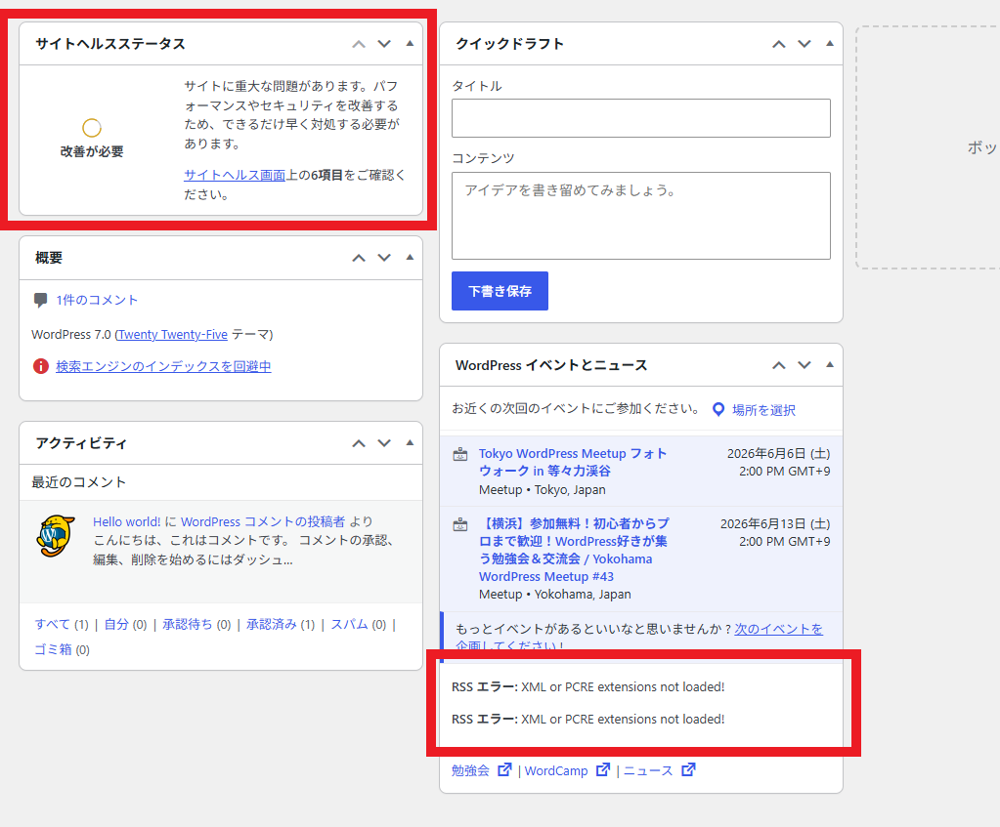
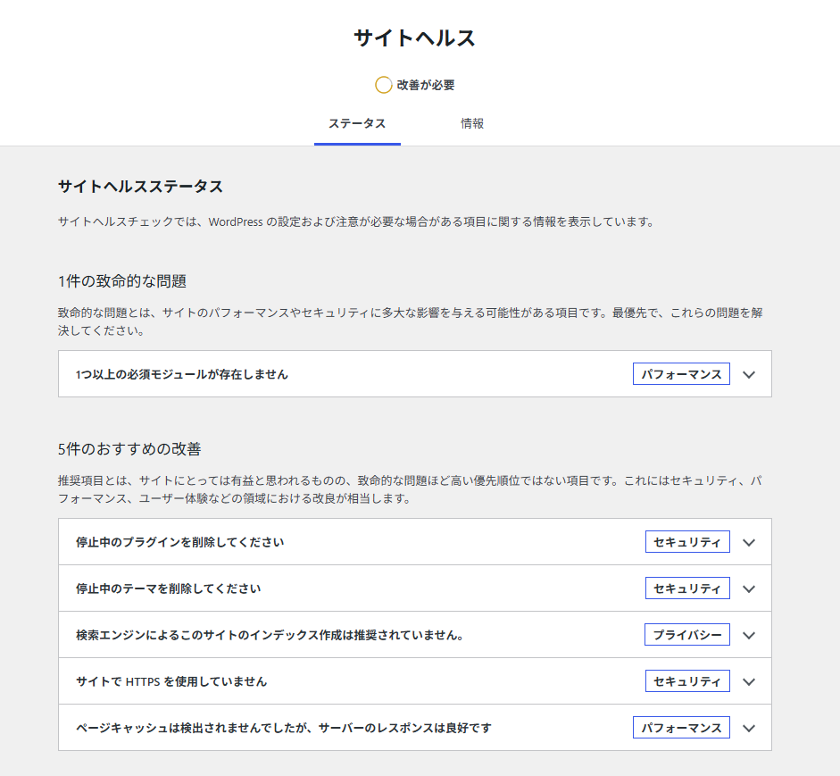
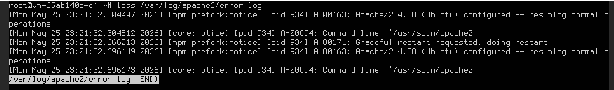
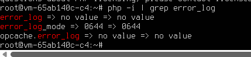
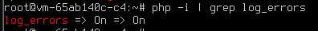
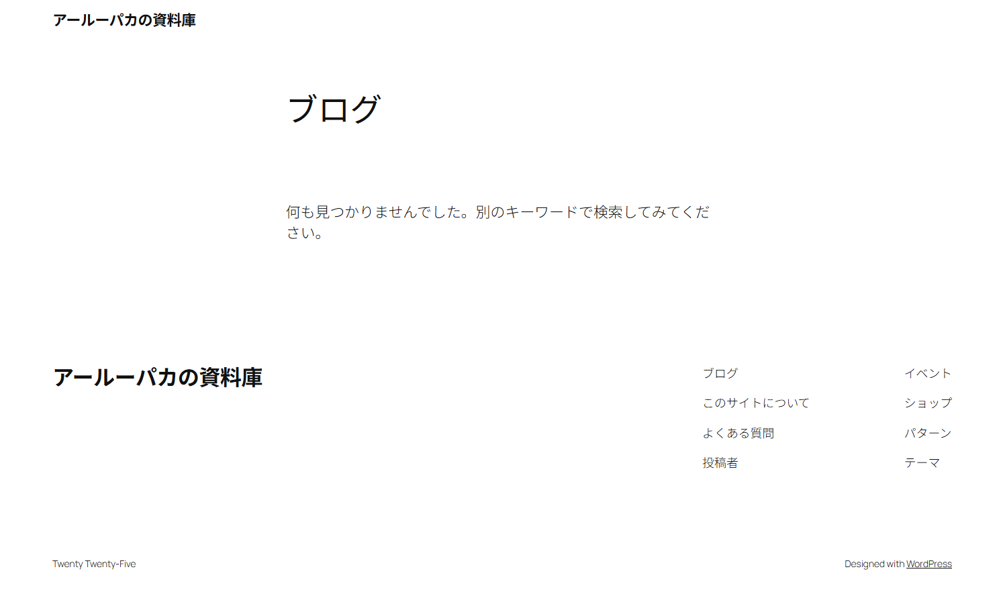

# WordPress 7 自動更新後の確認ログ

## 概要
WordPress7.0がリリースされました。
自動更新は有効化していない認識でしたが、有効化されていたらしく自動更新されました。
自動更新されたことに気がついな後に対応したことをメモしています。

## 対応事項
- ダッシュボードのエラー内容確認
- サイトヘルスのエラー確認
- Apache2のエラーログ確認
- PHPのエラーログ確認
- 「アールーパカの資料庫」のトップページにアクセス

## ダッシュボードのエラー内容チェック
- 以前出ていたRSSエラーがあるのみで、新規のエラーは出ていませんでした。
- サイトヘルスが6項目から変動していないことを確認しました。
    

## サイトヘルスのエラー確認
- 致命的な問題と、おすすめの改善の件数に変動がないことを確認しました。
- 上記内容に関し、内容を記録していたわけではないので、断言はできませんが、<br>内容に変化はないように思います。
    

## Apache2のエラーログ確認
- 下記のパスのログを確認しました。
    ```
    /var/log/apache2/error.log
    ```
    - 出力されている内容が`notice`のみで`error`等が出力されていないことを確認しました。
        

## PHPのエラーログ確認
- そもそも、エラーログが出力されるのか確認しました。
    - 実行コマンド
        ```sh
        php -i | grep error_log
        ```
    - 実行結果
        
        - 結果を実行結果を見る限り、出力先は指定されていないようです。
        - ChatGPTに確認したところによると、指定がない場合は、apache2のエラーログに出力されるとのことです。
            - 後日、本当にそうかの確認はした方がよさそうです。
            - もしくは、PHPのエラーログの出力先を指定したほうがよさそうです。
- 一応、`log_errors`が有効化されているかも確認しました。
    - 実行コマンド
        ```sh
        php -i | grep log_errors
        ```
    - 実行結果
        
        - エラーを記録すること自体は有効化されているようです。

## 「アールーパカの資料庫」のトップページにアクセス
- 問題なくアクセスできることを確認しました。
    
    - 現時点で記事は作成していないので、記事が開けるかの確認は省略しています。

## 判断
- 現状問題なしと判断しました。

## 保留事項
- PHPのエラーログの出力確認
- PHPのエラーログの出力ファイルの指定