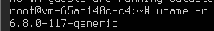
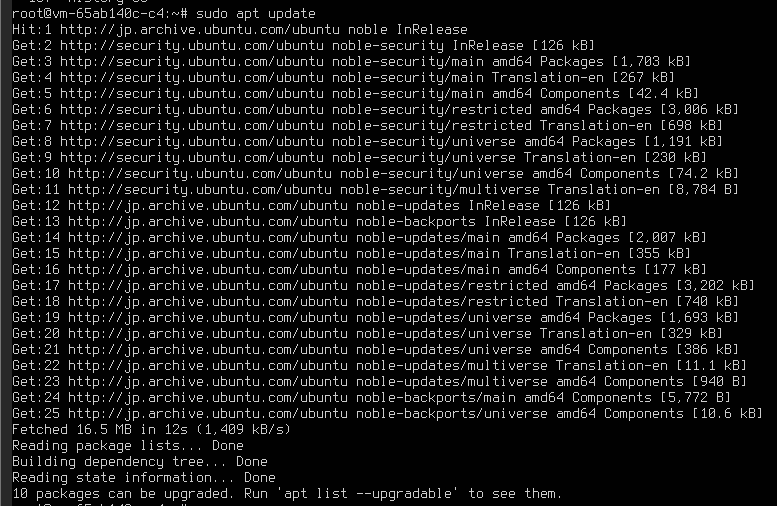
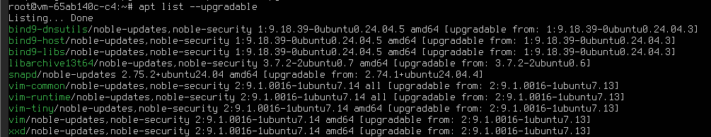
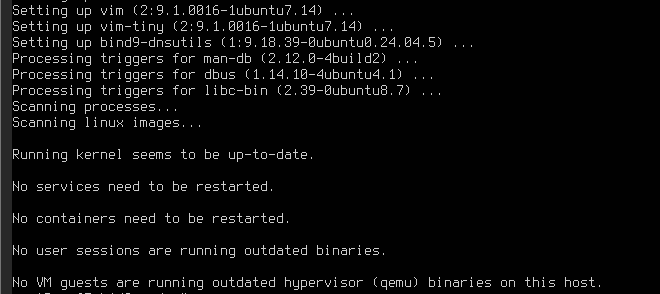

# 概要
Ubuntuのアップデート手順の記録です。

# 実施手順
- 更新前の対応
- 更新の取得
- 更新内容があるか確認
- 更新の実施
- 更新後の対応
    - OSの再起動

## 更新前の対応
- カーネルに関するCVEが発行された場合
    - カーネルのバージョンチェック
        - 実行コマンド
            ```sh
            uname -r
            ```
        - 実行結果<br>
            

## 更新の取得
- 実行コマンド
    ```sh
    sudo apt update
    ```
- 実行結果<br>
   

## 更新内容があるか確認
- 実行コマンド
    ```sh
    apt list --upgradable
    ```
- 実行結果<br>
    

## 更新の実施
- 実行コマンド
    ```sh
    sudo apt upgrade -y
    ```
- 実行結果<br>
    
        - 今回は再起動対象はない

## 更新後の対応
- OSの再起動
    - OSの再起動を求められた場合に、実施する。
    - 実行コマンド
        ```sh
        sudo reboot
        ```
    - 実行結果<br>
- カーネルのバージョンチェック
    - カーネルに関するCVEが発行された場合は、確認したほうが良い
    - 実行コマンド
        ```sh
        uname -r
        ```
    - 実行結果<br>
        
